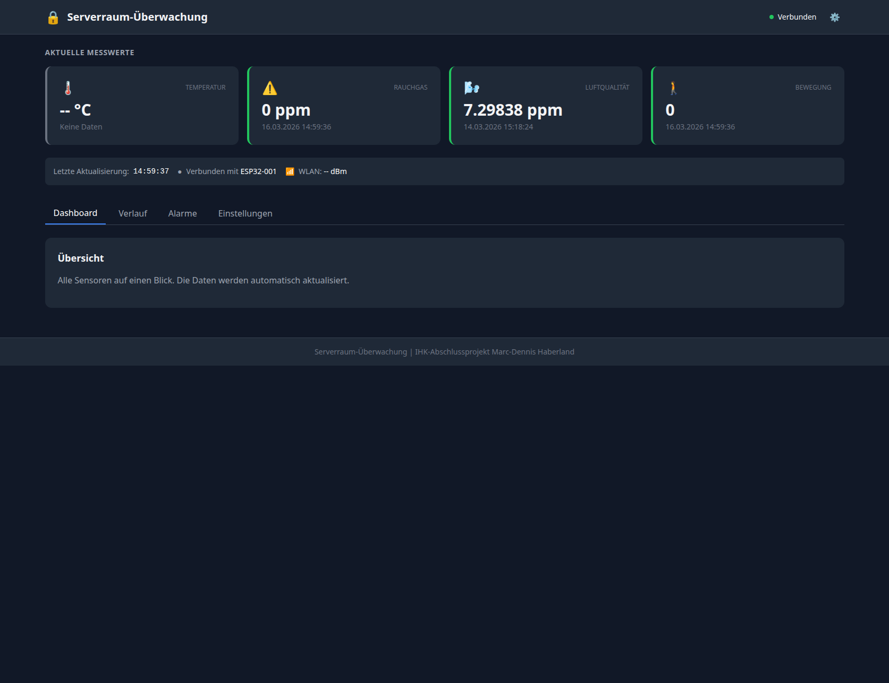

# Serverraum-Überwachung

> **English TL;DR:** End-to-end server-room monitoring — ESP32 sensor nodes (DS18B20/SHT31/MQ-2/PIR) send telemetry over MQTT to a FastAPI backend with an alarm engine; vanilla-JS dashboard visualizes everything. Full IoT stack, runnable without hardware via the bundled simulator.

Selbst gebaute **Serverraum-Überwachung** mit Raspberry-Pi-/ESP32-Hardware: Sensorknoten messen Temperatur, Luftfeuchte, Bewegung und Rauchgas, funken per MQTT an ein FastAPI-Backend, das Alarme auswertet und alles in einer Web-Dashboard-Oberfläche visualisiert.



## Architektur

```
┌──────────────┐   MQTT    ┌─────────────────┐   SQL   ┌───────────┐
│ ESP32-Firmware│ ───────▶ │ FastAPI-Backend │ ──────▶ │  MariaDB/ │
│ (Sensornodes) │ ◀─────── │ + Alarm-Engine  │         │  MySQL    │
└──────────────┘  Alerts  └────────┬────────┘         └───────────┘
                                   │ REST
                            ┌──────▼──────┐
                            │  Web-       │
                            │  Dashboard  │
                            └─────────────┘
```

## Komponenten

### 📡 `firmware/` — ESP32-Sensorknoten (C++/PlatformIO)
- **DS18B20** (1-Wire, GPIO 4) — Temperatur
- **SHT31** (I²C) — Temperatur + Luftfeuchte
- **MQ-2** (GPIO 1) — Rauch-/Gasdetektion
- **PIR** — Bewegungsmelder
- Sendet Messwerte per MQTT (Topic-Prefix `serverraum/sensor/…`)

### 🐍 `backend/` — FastAPI-Server
- **Alarm-Engine** (`alarm_engine.py`) — Schwellwert- und Ereignisauswertung
- **MQTT-Client** (`mqtt_client.py`) — Empfang der Sensorwerte
- REST-API + statisches Frontend-Hosting
- **Dev-Werkzeuge:** eigener MQTT-Broker-Mock (`mock_broker.py`), Sensor-Simulator (`simulate_sensors.py`) — kompletter Stack ohne Hardware testbar
- Tests unter `backend/tests/`

### 📊 `frontend/` — Web-Dashboard
Vanilla JS (kein Framework-Build nötig): Live-Charts (`charts.js`), API-Layer (`api.js`), Dashboard-Logik (`dashboard.js`).

### 🗄️ `sql/`
Datenbank-Schema (`schema.sql`) + Backend-Migrationen.

## Schnellstart (ohne Hardware)

```bash
cd backend
pip install -r requirements.txt
python mock_broker.py            # MQTT-Broker-Mock starten
python simulate_sensors.py       # virtuelle Sensoren füttern
uvicorn app.main:app --reload    # API + Dashboard
# → http://localhost:8000
```

Mit echter Hardware: `firmware/` mit PlatformIO auf die ESP32-Node flashen und MQTT-Endpoint in der Firmware-Konfiguration setzen.

## Tech-Stack

| Layer | Technologie |
|---|---|
| Firmware | C++ / PlatformIO (ESP32) |
| Backend | Python, FastAPI, paho-mqtt, MySQL-Connector |
| Frontend | Vanilla JS, Chart-Rendering ohne Framework |
| Datenbank | MySQL/MariaDB |
| Protokoll | MQTT |
