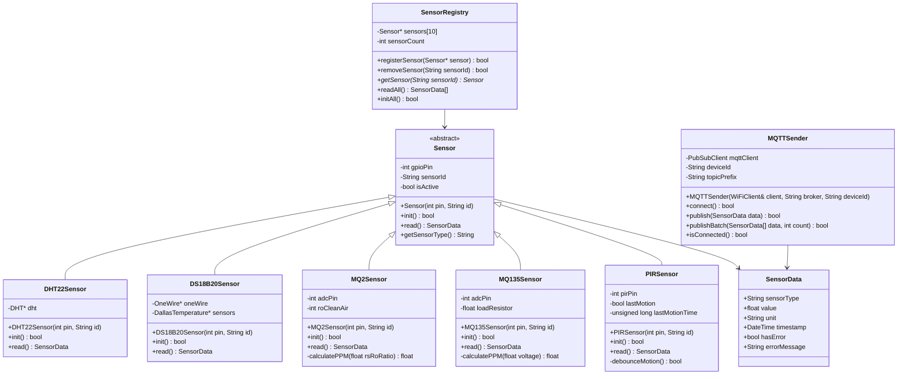

# Klassendiagramm – Sensor-Polymorphie

## Übersicht

Das Klassendiagramm zeigt die objektorientierte Struktur der ESP32-Firmware mit Polymorphie zur Sensor-Abstraktion.

## Erklärung der Klassen

### Sensor (abstrakte Basisklasse)
Die abstrakte Basisklasse `Sensor` definiert das gemeinsame Interface für alle Sensoren:
- `init()`: Initialisierung des Sensors
- `read()`: Messwert lesen
- `getSensorType()`: Sensortyp abfragen

### Konkrete Sensor-Klassen
Jeder Sensor erbt von `Sensor` und implementiert seine eigene Logik:
- **DHT22Sensor**: Temperatur und Luftfeuchtigkeit (digital)
- **DS18B20Sensor**: Temperatur (OneWire)
- **MQ2Sensor**: Rauchgas (analog)
- **MQ135Sensor**: Luftqualität (analog)
- **PIRSensor**: Bewegung (digital)

### SensorRegistry
Verwaltet alle Sensoren und ermöglicht:
- Registrierung/Entfernung von Sensoren
- Globales Auslesen aller Sensoren

### MQTTSender
Kümmert sich um die MQTT-Kommunikation:
- Verbindungsaufbau zum Broker
- Publishen von Sensordaten

## Vorteile der Polymorphie

1. **Wartbarkeit**: Neue Sensoren können einfach hinzugefügt werden
2. **Erweiterbarkeit**: Änderungen an einem Sensor beeinflussen nicht andere
3. **Testbarkeit**: Jeder Sensor kann einzeln getestet werden
4. **Lesbarkeit**: Klare Struktur und einheitliches Interface
