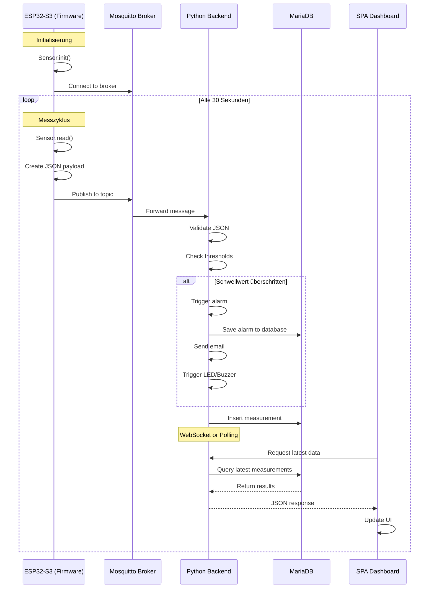
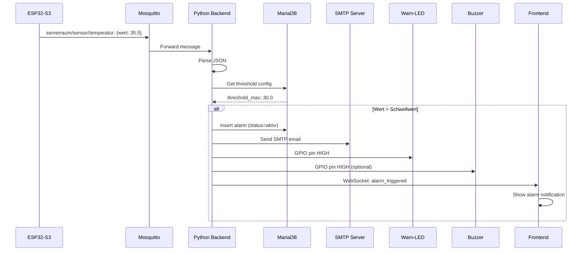
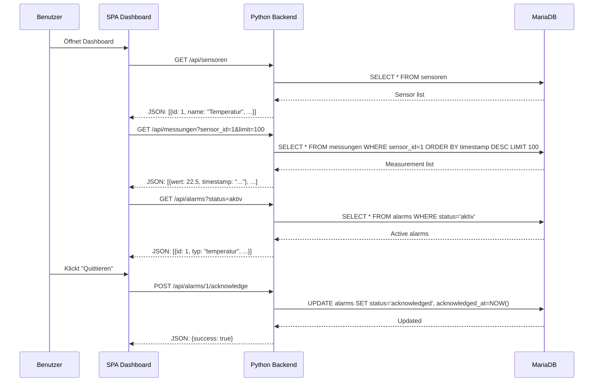
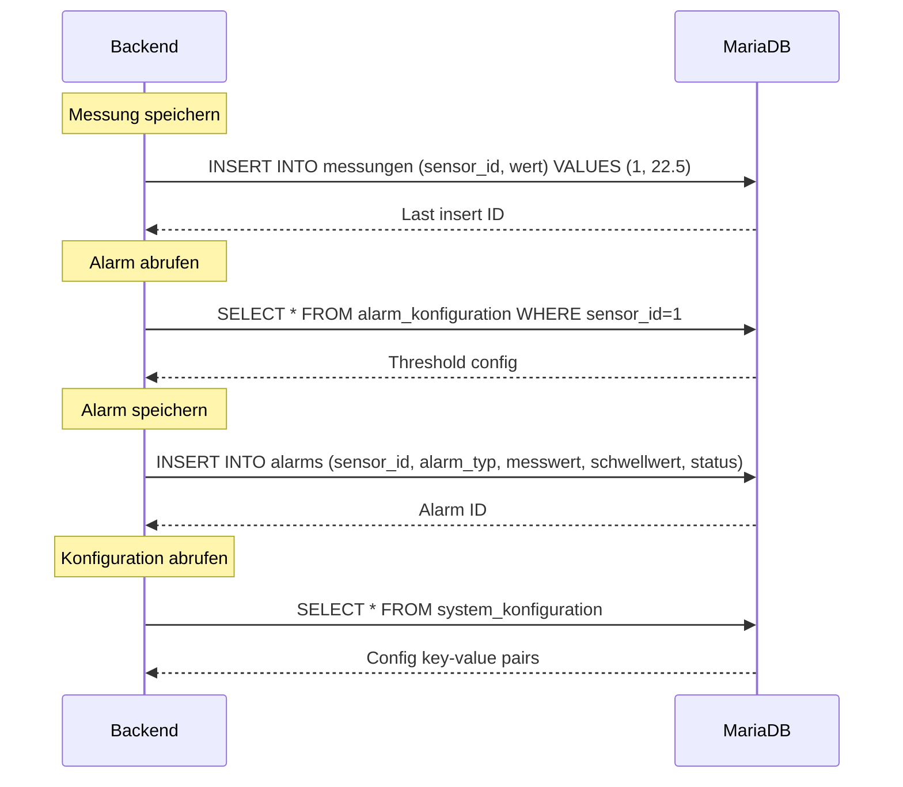

# Sequenzdiagramm – MQTT-Datenfluss

## Übersicht

Das Sequenzdiagramm zeigt den kompletten Datenfluss vom Sensor bis zum Dashboard.

## Vollständiger Datenfluss

## Alarmierungs-Flow

## API-Kommunikation

## Datenbank-Operationen

